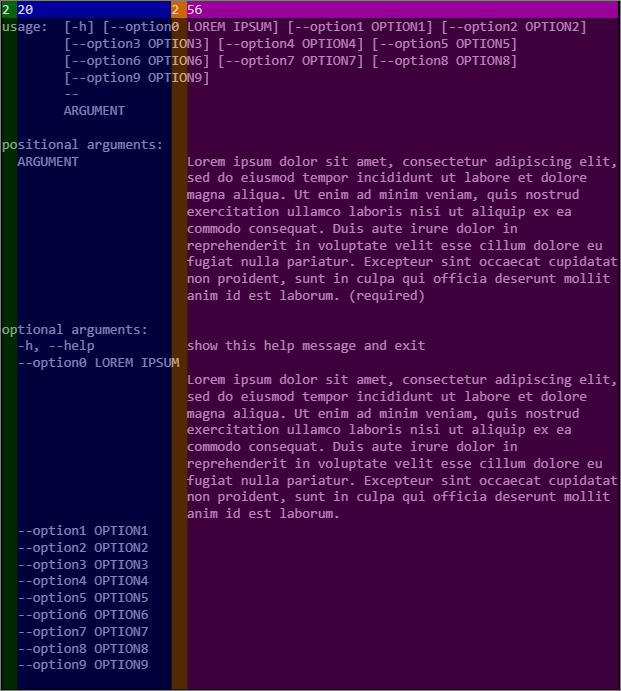
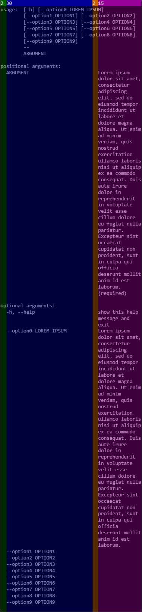
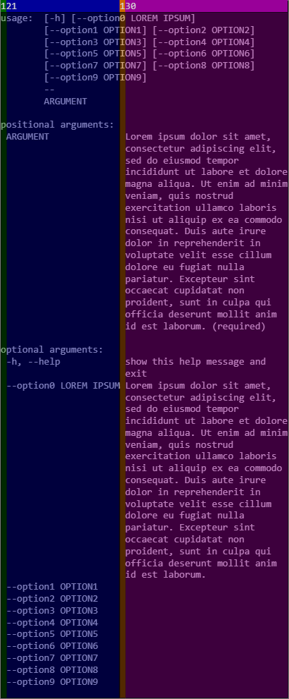

# Usage

## setUsage

```cpp
void setUsage(const char* usage);
```

## getUsage

```cpp
std::string getUsage() const;
```

## setDescription

```cpp
void setDescription(const char* description);
```

## setEpilog

```cpp
void setEpilog(const char* epilog);
```

## setUsageWidth


```cpp
args.setUsageWidth(2, 20, 2, 56); // default
```



```cpp
args.setUsageWidth(2, 30, 2, 15);
```



```cpp
args.setUsageWidth(1, 21, 1, 30);
```

